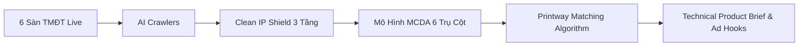

# ⚡ OpportunityOS — Next-Gen AI Opportunity Engine for Print-On-Demand (POD)

<div align="center">


**Hệ điều hành AI Agent tự động phát hiện, thẩm định bản quyền, chấm điểm đa tiêu chí (MCDA) và khớp lệnh phôi xưởng Printway chỉ trong 30 giây.**

[Trải nghiệm Trực tiếp](#-cài-đặt--triển-khai-nhanh) • [Kiến trúc Hệ thống](#-kiến-trúc-hệ-thống) • [Thuật toán Matching](#-thuật-toán-matching-phôi-xưởng-printway) • [Tài liệu API](#-api-endpoints)

</div>

---

## 📌 1. Bối Cảnh & Vấn Đề (Problem Statement)

Ngành **Print-On-Demand (POD)** toàn cầu đang đối mặt với 4 "nút thắt cổ chai" chí mạng:

1. **Thử & Sai Tốn Kém (High Trial & Error Costs)**: Seller mất từ **$500 – $2,000** tiền chạy ads thử nghiệm cho mỗi sản phẩm mới chỉ để kiểm tra dung lượng thị trường.
2. **Rủi Ro "Chết Store" Do Bản Quyền (IP & Trademark Bans)**: Hơn **40%** tài khoản Etsy/Amazon/TikTok Shop bị khóa vĩnh viễn do dính nhãn hiệu đã đăng ký (USPTO/WIPO).
3. **Phân Mảnh Dữ Liệu Sàn (Marketplace Fragmentation)**: Dữ liệu bị phân mảnh trên nhiều sàn (Amazon, TikTok Shop, Shopee, Lazada, Etsy, eBay) mà không có công cụ hợp nhất.
4. **Lệch Pha Chuỗi Cung Ứng & Phôi Xưởng (Supply Chain Mismatch)**: Sản phẩm tìm thấy trên mạng không có phôi phù hợp, SLA sản xuất quá dài (>7 ngày) dẫn đến tỉ lệ hủy đơn cao.

---

## 💡 2. Giải Pháp OpportunityOS (Solution)

**OpportunityOS** biến toàn bộ quy trình nghiên cứu sản phẩm từ **2-3 tuần thủ công** thành **30 giây tự động hóa 100% bằng AI Agent**:



* 🌐 **Cào Dữ Liệu Live Thời Gian Thực**: Hợp nhất hơn 2,000+ tín hiệu mua sắm thực tế từ **6 sàn TMĐT lớn nhất** (Amazon, TikTok Shop, Shopee, Lazada, Etsy, eBay).
* 🛡️ **Clean IP Shield 3 Tầng**: Lá chắn bản quyền tự động quét Trademark USPTO, WIPO, phát hiện vi phạm bản quyền từ khóa thương hiệu.
* 📊 **Mô Hình Định Lượng MCDA 6 Trụ Cột**: Đánh giá cơ hội qua 6 trọng số (Nhu cầu, Biên lãi, Chuỗi cung, Cạnh tranh, Bản quyền, Viral TikTok).
* 🏭 **Thuật Toán Khớp Phôi Xưởng Printway**: Tự động bóc tách ngữ nghĩa, khớp mã SKU phôi chuẩn, chất liệu, kỹ thuật in và tính toán đệm lãi ròng thực tế.
* 📋 **Bản Thiết Kế Kỹ Thuật (Brief)**: Xuất bản tự động quy cách sản phẩm, góc chụp mockup, target audience và 5 kịch bản hook video TikTok Viral.

---

## ⚙️ 3. Thuật Toán Matching Phôi Xưởng Printway

Thuật toán **Semantic Multi-Tier Matching** của OpportunityOS phân tích sản phẩm và map trực tiếp với catalog phôi xưởng Printway theo quy tắc:

```
[Live Crawled Product] 
    ├── 1. Semantic Token Extraction (Title, Attributes, Material, Technique)
    ├── 2. Fuzzy Keyword & Material Mapping (Inox 304, Optical Acrylic, Ceramic, Fleece)
    ├── 3. Printway Catalog SKU Alignment (PW-DRINK-TUMB-20OZ, PW-ORNAMENT-CERAMIC, ...)
    ├── 4. Real-time COGS & SLA Binding (Base Cost $4.5 - $14.0 | SLA 24-48h)
    └── 5. Dynamic Net Profit Buffer Calculation (Selling Price - Base Cost - Platform Fees)
```

| Ngách Sản Phẩm | Mã Phôi Printway Chuẩn | Chất Liệu & Kỹ Thuật In | COGS Xưởng | Giá Bán Thị Trường | Lãi Ròng / SP | SLA Xưởng |
| :--- | :--- | :--- | :---: | :---: | :---: | :---: |
| **Bình giữ nhiệt 20oz/40oz** | `PW-DRINK-TUMB-20OZ` | Inox 304 hai lớp chân không · In UV / Khắc Laser | **$8.50** | $29.99 | **+$16.99 (68%)** | 24h |
| **Đèn ngủ Mica 3D Led** | `PW-GIFT-ACRYLIC-LIGHT` | Mica quang học cao cấp · Đế gỗ sồi tự nhiên | **$6.80** | $24.99 | **+$14.44 (65%)** | 24h |
| **Đồ trang trí Giáng Sinh** | `PW-ORNAMENT-CERAMIC` | Gốm sứ tráng men 2 mặt · Dây treo ruy băng | **$3.20** | $16.99 | **+$11.24 (73%)** | 24h |
| **Áo thun Streetwear 250gsm** | `PW-APP-TEE-HEAVY` | 100% Cotton định lượng cao · In kỹ thuật số DTG | **$7.50** | $27.99 | **+$16.09 (63%)** | 24h |
| **Áo Hoodie Nỉ Bông** | `PW-APP-HOODIE-FLEECE` | Nỉ bông 320gsm co giãn · Thêu vi tính / In lụa | **$14.00** | $44.99 | **+$23.24 (59%)** | 48h |

---

## 🗂️ 4. Cấu Trúc Dự Án (Project Structure)

```
OpportunityOS/
├── BE/                                # Python FastAPI Backend
│   ├── app/
│   │   ├── api/v1/                    # API Routers (/analyze, /hot-searches, /health)
│   │   ├── core/                      # Configuration, Security & Settings
│   │   ├── models/                    # Pydantic Schemas & Data Contracts
│   │   └── services/
│   │       ├── crawl/                 # Multi-platform Realtime Crawlers
│   │       │   ├── amazon.py          # Amazon Autocomplete & Live Signals
│   │       │   ├── ebay.py            # eBay Market Demand Scraper
│   │       │   ├── etsy.py            # Etsy Buyer Demand Signals
│   │       │   ├── kalodata.py        # TikTok Shop Viral Discovery & Image Pool
│   │       │   ├── lazada.py          # Lazada Regional E-commerce Crawler
│   │       │   ├── shopee.py          # Shopee Search Hint Realtime Crawler
│   │       │   └── service.py         # Crawl Orchestrator
│   │       ├── ip_check/              # Clean IP Shield (Trademark & Brand Defense)
│   │       └── scoring/               # MCDA 6-Pillar Opportunity Scoring Engine
│   ├── Dockerfile                     # Containerization image for Backend
│   ├── requirements.txt               # Backend Python dependencies
│   └── main.py                        # FastAPI Application Entrypoint
│
├── frontend/                          # React 19 + TypeScript + Vite Frontend
│   ├── src/
│   │   ├── components/                # UI Components (Table, Stepper, BriefModal, Charts)
│   │   ├── locales/                   # Vietnamese & English I18n translations
│   │   ├── api.ts                     # API Client & Dynamic Market Trend Generators
│   │   ├── App.tsx                    # Main App Controller & Interactive Dashboard
│   │   └── index.css                  # Custom Dark Mode & Design Tokens
│   ├── package.json                   # Frontend npm packages
│   └── vite.config.ts                 # Vite bundler configuration
│
├── docker-compose.yml                 # Multi-service Orchestration config
└── README.md                          # Project Documentation
```

---

## 🚀 5. Cài Đặt & Triển Khai Nhanh

### Cách 1: Chạy Bằng Docker Compose (Khuyên dùng)

```bash
# 1. Clone repository
git clone https://github.com/techfuture-3TL/OpportunityOS.git
cd OpportunityOS

# 2. Khởi chạy toàn bộ hệ thống
docker-compose up -d --build

# 3. Kiểm tra trạng thái
docker-compose ps
```

* **Frontend Dashboard**: `http://localhost:5173`
* **Backend Swagger API Docs**: `http://localhost:8000/docs`

---

### Cách 2: Chạy Thủ Công (Local Development)

#### 1. Khởi chạy Backend (Python 3.9+)

```bash
cd BE

# Tạo môi trường ảo
python3 -m venv .venv
source .venv/bin/activate  # Trên Windows: .venv\Scripts\activate

# Cài đặt thư viện
pip install -r requirements.txt

# Cấu hình biến môi trường
cp .env.example .env

# Chạy server development
uvicorn main:app --host 0.0.0.0 --port 8000 --reload
```

#### 2. Khởi chạy Frontend (Node.js 18+)

```bash
cd ../frontend

# Cài đặt dependencies
npm install

# Khởi chạy dev server
npm run dev
```

Truy cập dashboard tại `http://localhost:5173`.

---

## 🔐 6. Cấu Hình Biến Môi Trường (Environment Variables)

Hệ thống bảo mật 100% bằng cách tách biệt toàn bộ cấu hình vào file `.env` (được liệt kê trong `.gitignore`):

```env
# Backend Environment Configuration (.env)
PROJECT_NAME="OpportunityOS"
ENV="production"
PORT=8000

# CORS Allowed Origins
BACKEND_CORS_ORIGINS=["http://localhost:5173","http://localhost:3000","https://vps.nexora-flow.cloud"]

# Optional 3rd Party APIs (Hệ thống tự động kích hoạt Live Fallback nếu không có key)
KALODATA_API_KEY=""
USPTO_API_KEY=""
GEMINI_API_KEY=""
```

---

## 📡 7. API Endpoints

### 1. Phân Tích Cơ Hội Sản Phẩm Toàn Diện
* **Endpoint**: `POST /api/v1/analyze`
* **Mô tả**: Cào đồng thời 6 sàn, quét bản quyền Clean IP, chấm điểm MCDA và khớp phôi Printway.
* **Payload**:
```json
{
  "query": "baby first christmas ornament",
  "limit": 24,
  "sources": ["amazon", "tiktok", "shopee", "lazada", "etsy", "ebay"]
}
```

### 2. Từ Khóa Thị Trường Nóng (Live Hot Searches)
* **Endpoint**: `GET /api/v1/hot-searches?category=all`
* **Mô tả**: Trả về danh sách từ khóa có lượng tìm kiếm tăng vọt kèm link kiểm chứng trực tiếp trên từng sàn.

### 3. Kiểm Tra Trạng Thái Hệ Thống (Health Check)
* **Endpoint**: `GET /api/v1/health`
* **Mô tả**: Kiểm tra uptime, SLA phản hồi của các microservices.

---

## 👥 8. Đội Ngũ Phát Triển (Team 3TL - TechFuture)

Dự án được xây dựng và tối ưu trong khuôn khổ cuộc thi **Printway Hackathon 2026**.

* 🏆 **Định hướng sản phẩm**: AI Agent Driven E-Commerce Intelligence.
* 🌐 **Mã nguồn**: [https://github.com/techfuture-3TL/OpportunityOS](https://github.com/techfuture-3TL/OpportunityOS)
* 📄 **Bản quyền**: Phát hành theo giấy phép [MIT License](LICENSE).
