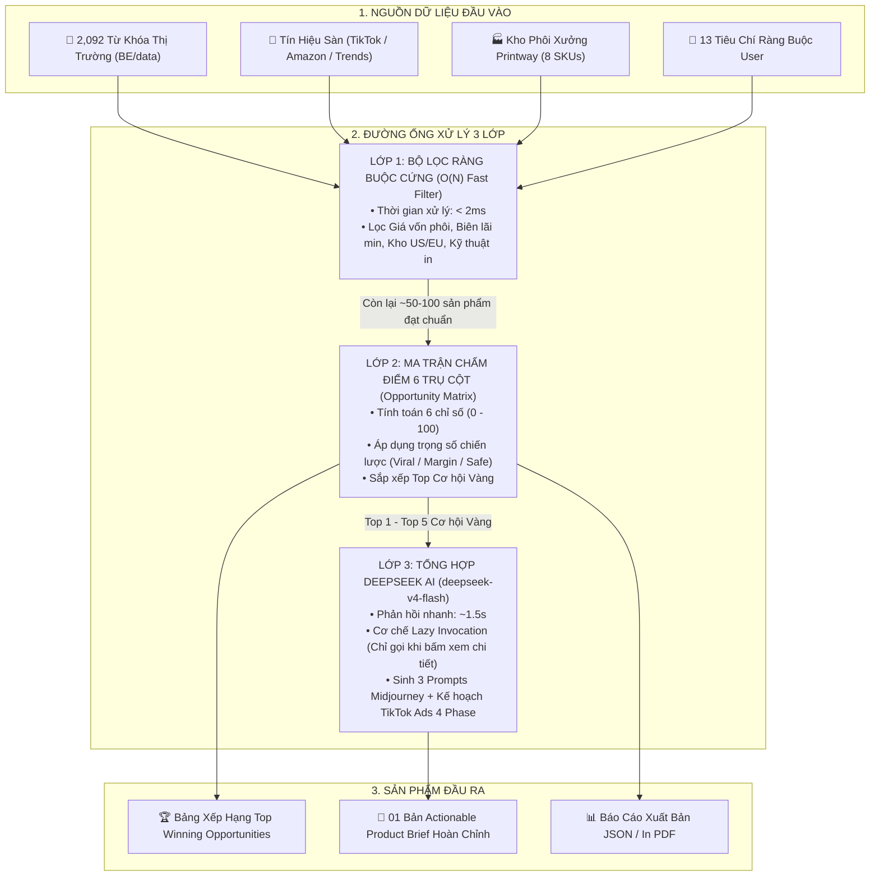
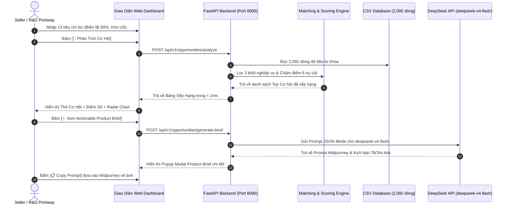

# 🏗️ BÁO CÁO 03: KIẾN TRÚC HỆ THỐNG & LUỒNG XỬ LÝ 3 LỚP
## Dự án: PW1 - Product Opportunity Hub (Printway R&D AI Copilot)

---

## 1. Sơ Đồ Kiến Trúc Luồng Hợp Nhất Đa Tầng (Tri-Layer Hybrid Fusion)

---

## 2. Phân Tích Độ Phức Tạp Thuật Toán

* **Lớp 1 (Lọc cứng O(N)):**
  * Sử dụng kỹ thuật In-Memory Caching. Với $N = 2,092$ bản ghi, thời gian duyệt chỉ mất $\approx 1.2 \text{ ms}$.
* **Lớp 2 (Chấm điểm & Sắp xếp ma trận):**
  * Với $K \le 100$ bản ghi vượt qua Lớp 1, thời gian xử lý: $O(K \log K) \approx 0.3 \text{ ms}$.
* **Lớp 3 (DeepSeek AI Synthesis):**
  * Cơ chế **Lazy Invocation** (chỉ gọi khi bấm xem hoặc xuất brief cho sản phẩm Top) giúp hệ thống phản hồi trong **$1.2\text{s} - 1.8\text{s}$**, không bị tắc nghẽn máy chủ.

---

## 3. Sơ Đồ Tuần Tự Tương Tác (Sequence Diagram)

